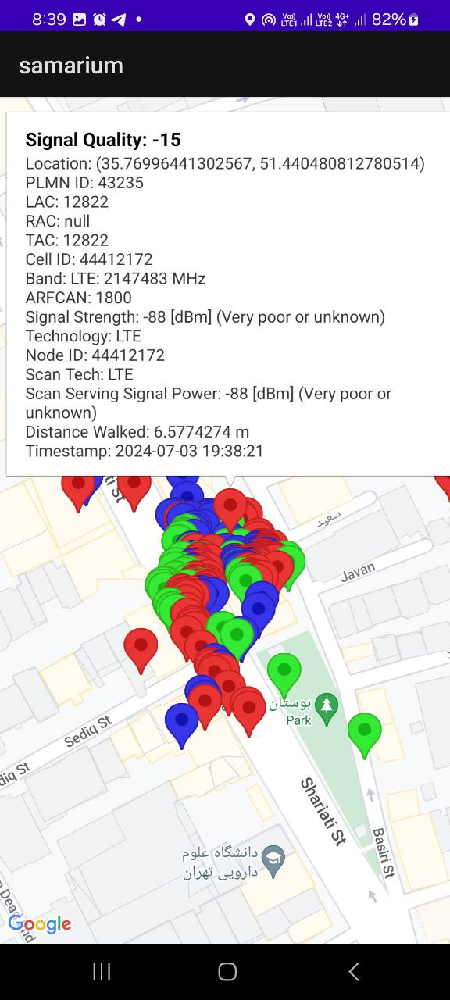
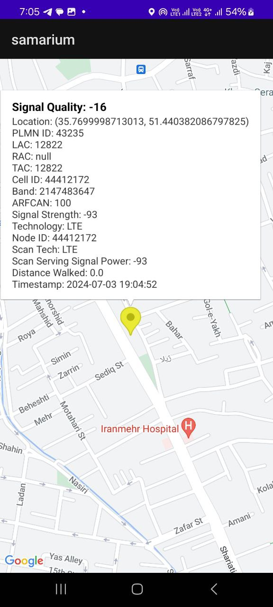
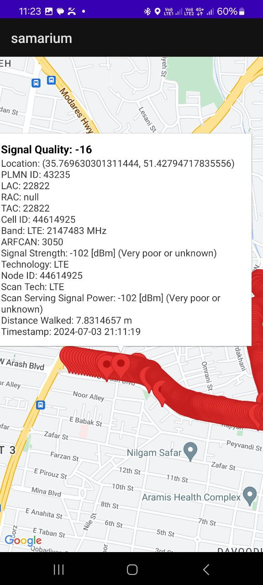
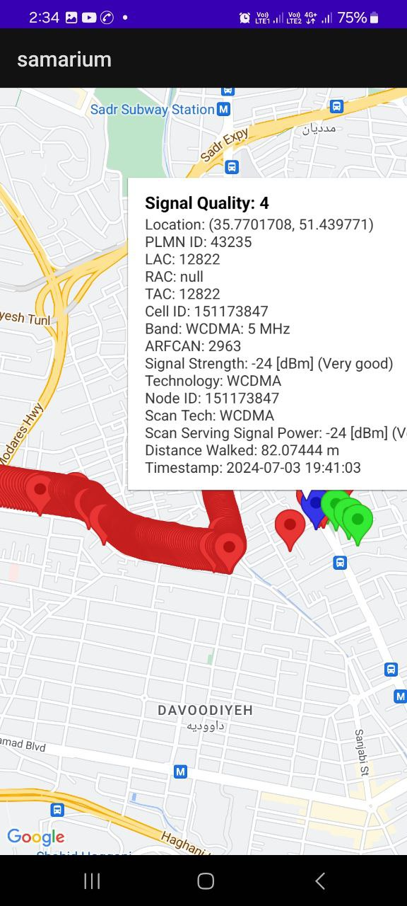

# Samarium project 

## Team Members
<table align="center">
  <tr>
    <td align="center" style="padding: 10px;">
      
       Pooria Rahimi
    </td>
    <td align="center" style="padding: 10px;">
      
       Ali Soltani
    </td>
  </tr>
</table>

## Project Description
In this project, we aimed to display a set of parameters on a map based on the provided information. The main goal of the project is to create an Android application that shows our route on a map while we are on the move. Additionally, the application will display each location with different colors depending on the signal strength, whether weak or strong.

Each location also has a set of information that we store in a database implemented using SQLite. Subsequently, we display those parameters on the map.

### Initial Setup
First, we start creating the Android application on a hardware device as shown below:

  
  

In the first image, we create the Samarium application and then run it.

After running the code, the application starts, and we enter the following environment:

  
  

Next, we display a sample of the information, parameters, and the route taken:

  
  

## Features
- Real-time route display on the map
- Signal strength indication with different colors
- Storage of location information in an SQLite database
- Display of stored parameters on the map

## Technology Stack
- Android
- SQLite
- Kotlin
- Google Maps API (or other relevant mapping service)

## How to Run
1. Clone the repository.
2. Open the project in Android Studio.
3. Please sync the Gradle file first so that you don't run into problems later.
4. Build and run the project on an Android device or emulator.

## Contributors
- Pooria Rahimi
- Ali Soltani
